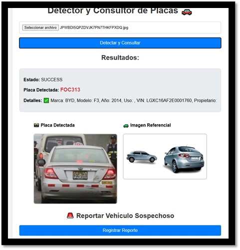
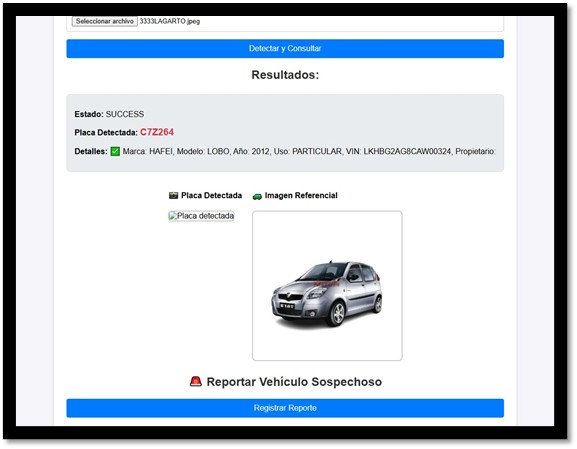

# 🚗 Sistema Inteligente de Reconocimiento de Placas (ALPR)

Un producto mínimo viable (MVP) para la detección automatizada y lectura de placas vehiculares peruanas utilizando Visión Artificial (Computer Vision) y Machine Learning. 

Este proyecto fue desarrollado para optimizar y automatizar el control de accesos en estacionamientos, reduciendo significativamente los tiempos de registro manual y mejorando la seguridad.

## 🚀 Características Principales

*   **Detección en Tiempo Real:** Utiliza un modelo YOLO entrenado con un dataset personalizado de +8,000 imágenes para detectar placas con alta precisión (97.2%).
*   **Interfaz Web:** Aplicación web intuitiva para la carga de imágenes, procesamiento y visualización de resultados al instante.
*   **Gestión de Datos:** Integración con base de datos **PostgreSQL** para registrar el historial de vehículos detectados.
*   **Despliegue en la Nube:** Configurado para integración y despliegue continuo (CI/CD) utilizando **Render** (`render.yaml`).

## 🛠️ Stack Tecnológico

*   **Lenguaje:** Python
*   **Machine Learning / Computer Vision:** YOLO (Ultralytics), OpenCV
*   **Backend / API:** Flask / FastAPI
*   **Base de Datos:** PostgreSQL
*   **Cloud / Deployment:** Render

## 📸 Demostración

A continuación, ejemplos del modelo detectando placas vehiculares:




## ⚙️ Instalación y Uso Local

Si deseas ejecutar este proyecto en tu entorno local para probar el modelo, sigue estos pasos:

1. **Clonar el repositorio:**
   ```bash
   git clone [https://github.com/TU_USUARIO/ProyectoPlacas.git](https://github.com/TU_USUARIO/ProyectoPlacas.git)
   cd ProyectoPlacas
